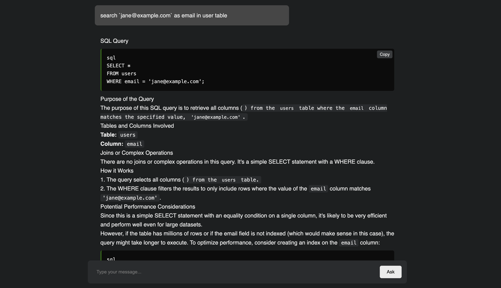

# D-Bee - Simple Sentence to SQL Queries in Seconds

Learn SQL effortlessly, generate complex queries, and execute them seamlessly—all with the power of AI.

## Overview

D-Bee leverages Llama 3.1 to process and execute queries efficiently. The application is built with a focus on extensibility and ease of use.

## How to run the application

1. Install Ollama using pip: `pip install ollama`
2. Install the Llama 3.1 model locally: `python -m ollama.download --model llama3.1`
3. Install the required packages with pip: `pip install -r requirements.txt`
4. Run the application using: `fastapi dev server/route.py`

## Features

- Natural language query processing
- Direct query execution and result display
- Context-aware schema understanding
- Modular plug-and-play architecture

## Roadmap

### Phase 1 - Core Implementation
- [x] Basic application setup with Llama 3.1 integration
- [ ] Word-to-query execution system
- [ ] Direct result display implementation

### Phase 2 - Enhanced Features
- [ ] Testing and benchmarking on different models like `sqlcoder`
- [ ] Improved schema context understanding
- [ ] Enhanced query processing capabilities
- [ ] Advanced result visualization

### Phase 3 - Architecture
- [ ] Plug-and-play component system
- [ ] Modular extension support
- [ ] API integration capabilities

## Getting Started

[Installation and setup instructions will be added as the project develops]

## Contributing

Contributions are welcome! Please feel free to submit pull requests.

## License

[License information to be added]